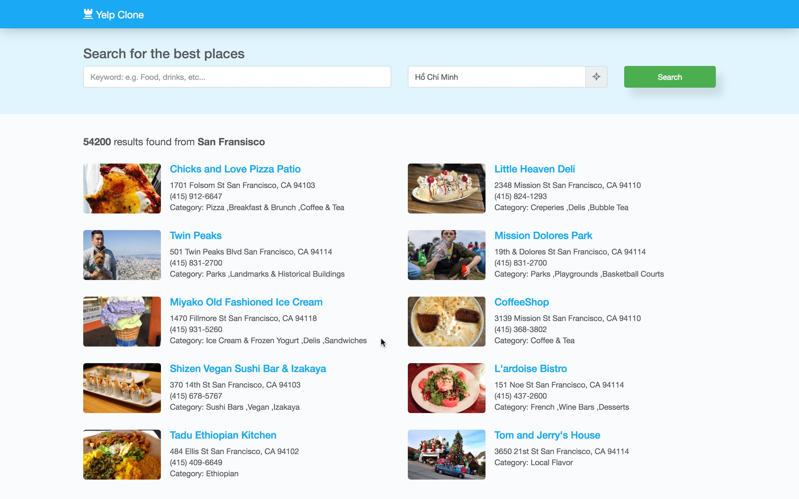
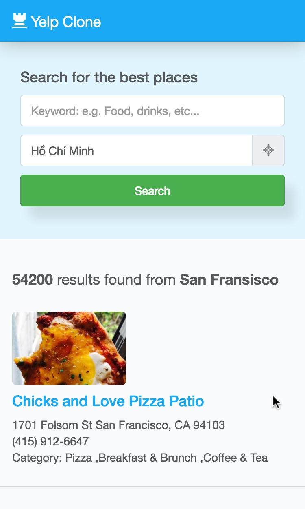

# Yelp Clone

## I. Screenshot

## II. Project Info

This web app was built to mimic a few features of Yelp. 

- You can search for businesses 
- This app will ask for your **location**, so make sure you **give it permission** if you want to test it's feature
- Please note that **"Ho Chi Minh city"** is **NOT** in the location list of Yelp.

A few more tech info

- **React** was used to build the interface
- **Webpack** was used to bundle app modules
- **Babel** was used to transform Javascript from ES6 to ES5
- **Bootstrap** and **LESS** was used to style the UI.
- **Google Map API** was use to reverse geocode the location.
- **Yelp API** was used to get data
- **Yarn** was used to manage packages and dependencies
 
## III. How to install

#### Note:

- You will need to run both a server and a browser to run the app. 
- You can replace `yarn` with `npm` to install dependencies. Or you can install yarn globally with `sudo npm install -g yarn`

#### Installation:

1. `yarn install` to install all dependencies
2. `yarn serve` to run the server
3. [Optional] `yarn release` if you want to rebuild the app
4. Open `http://localhost:8080/`

